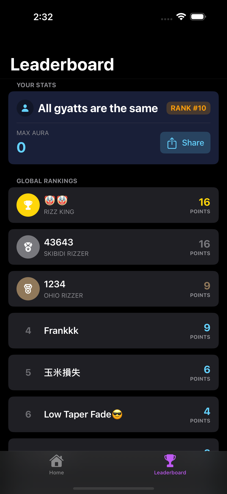

# Skibidi Swipe - Swift Gesture Game

A fast-paced mobile game built with SwiftUI where players respond to directional prompts by swiping in the correct direction.

## Features

-   **Intuitive Swipe Mechanics**: Respond to on-screen directional prompts with matching swipe gestures
-   **Progressive Difficulty**: Game becomes more challenging as your score increases
-   **Online Leaderboard**: Compete with other players and track your high scores
-   **Custom Settings**: Toggle sound effects, vibration feedback, and visual theme
-   **Particle Effects**: Enjoy celebratory animations when you achieve high scores
-   **Responsive Design**: Optimized for various iOS devices

## Screenshots


<div align="center">
  
  
  
  
  
</div>

## Requirements

-   iOS 17.0+
-   Xcode 15.0+
-   Swift 5.9+

## Installation

1. Clone the repository:

```bash
git clone https://github.com/yourusername/swift-swipe-game.git
```

2. Open the project in Xcode:

```bash
cd swift-swipe-game
open swift-swipe-game.xcodeproj
```

3. Configure your Supabase backend (for leaderboard functionality):

    - Create a `Secrets.xcconfig` file based on the template in the project
    - Add your Supabase API key and URL

4. Build and run the application in Xcode

## How to Play

1. Start the game from the welcome screen
2. Watch for directional arrows that appear on screen
3. Swipe in the corresponding direction (up, down, left, or right)
4. React quickly to increase your score
5. Be careful of fake-out directions that may appear at higher difficulty levels
6. Compare your high score on the leaderboard

## Architecture

-   **SwiftUI**: For the user interface
-   **SwiftData**: For local data persistence
-   **Supabase**: Backend for online leaderboard functionality

## Credits

-   Developed by Frank Lee
-   Icons and graphics from Frank Lee

## License

N/A
